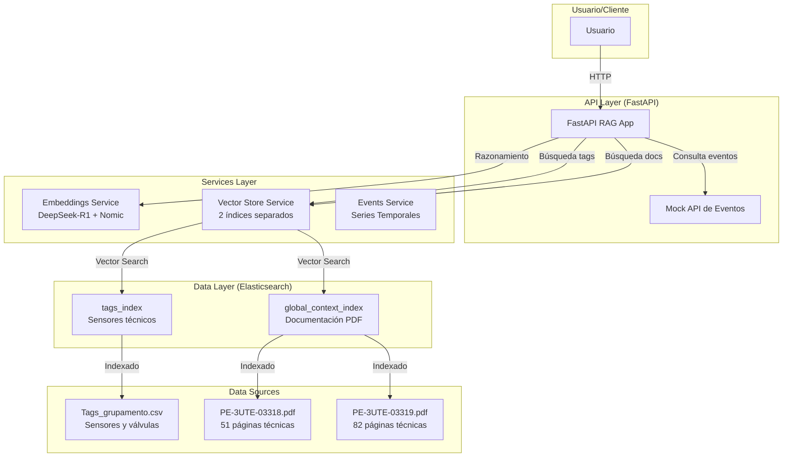
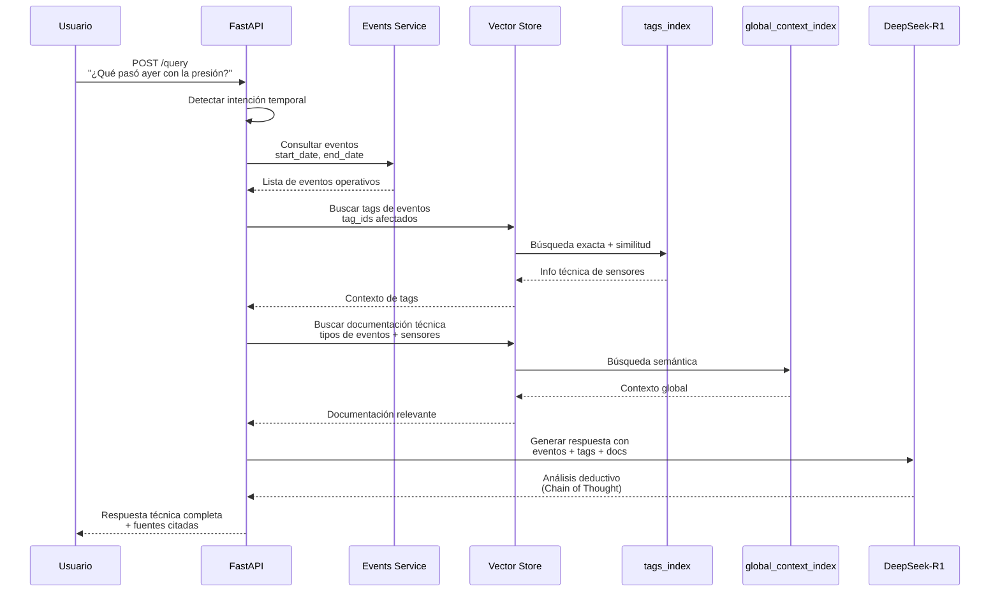
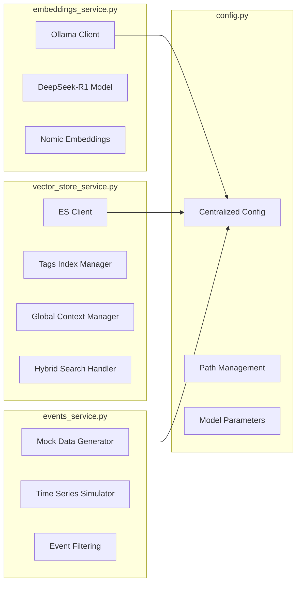

# Sistema RAG Inteligente de Ingeniería de Reservatorios

Un sistema avanzado de Retrieval-Augmented Generation (RAG) para análisis inteligente de pozos petroleros. Combina eventos de series de tiempo, información técnica de sensores (tags), y documentación especializada usando FastAPI, LangChain, Ollama (DeepSeek-R1), y Elasticsearch.

**Arquitectura de 4 Pasos:** Eventos → Tags → Contexto Global → Respuesta Inteligente

---

## Tabla de Contenidos
- [Vista General](#vista-general)
- [¿Qué es este Sistema?](#qué-es-este-sistema)
- [Arquitectura de Dos Índices](#arquitectura-de-dos-índices)
- [¿Por qué DeepSeek-R1?](#por-qué-deepseek-r1)
- [¿Cómo Funciona?](#cómo-funciona)
- [Estructura del Proyecto](#estructura-del-proyecto)
- [Instalación y Uso](#instalación-y-uso)
- [API Endpoints](#api-endpoints)
- [Testing con rest-client.http](#testing-con-rest-clienthttp)
- [Diagramas de Arquitectura](#diagramas-de-arquitectura)
- [Requerimientos](#requerimientos)
- [Despliegue](#despliegue)
- [Configuración Avanzada](#configuración-avanzada)

---

## Vista General

Este proyecto implementa un sistema RAG especializado en **ingeniería de reservatorios petroleros** que combina:

- **Eventos de Series de Tiempo**: API mock que simula eventos operativos detectados por algoritmos de ML
- **Tags Indexados Localmente**: Información técnica de sensores (presión, temperatura, flujo, válvulas)
- **Contexto Global**: Documentación técnica especializada de operaciones petroleras
- **DeepSeek-R1**: LLM avanzado para razonamiento deductivo (Chain of Thought)

El sistema está diseñado para responder preguntas complejas sobre operaciones de pozos inteligentes, analizando patrones en series temporales y correlacionando eventos con documentación técnica.

## ¿Qué es este Sistema?

Este sistema implementa una **arquitectura RAG híbrida especializada** que combina:

- **RAG Tradicional**: Recuperación de información técnica de documentación
- **Análisis de Eventos**: Procesamiento de series temporales operativas
- **Búsqueda Semántica de Tags**: Información técnica de sensores indexados localmente
- **Razonamiento Deductivo**: Uso de DeepSeek-R1 para análisis causal

### Diferencias Clave con RAG Estándar
- **Dos índices separados** en Elasticsearch (tags vs documentación)
- **API de eventos simulados** que reemplaza consultas externas
- **Flujo de 4 pasos** con razonamiento causal
- **Enfoque específico** en ingeniería de reservatorios petroleros

## Arquitectura de Dos Índices

### ¿Por Qué Dos Índices Separados?
1. **Naturaleza del Vector**: Los embeddings de descripciones técnicas cortas difieren semánticamente de párrafos largos de documentación
2. **Estrategias de Búsqueda Diferentes**: Precisión exacta para tags vs recuperación de pasajes largos para contexto
3. **Escalabilidad**: Re-indexar documentación sin afectar tags operativos

### Índices del Sistema
- **`tags_index`**: Vectores de sensores (presión, temperatura, válvulas, etc.)
- **`global_context_index`**: Chunks de documentación técnica PDF

## ¿Por qué DeepSeek-R1?

DeepSeek-R1 es elegido por sus capacidades excepcionales de **razonamiento deductivo**:

- **Chain of Thought Nativo**: Razona paso a paso sin necesidad de prompts complejos
- **Análisis Causal**: Excelente para correlacionar eventos con efectos en sistemas complejos
- **Contexto Técnico**: Mantiene precisión en terminología especializada de ingeniería
- **Eficiencia Local**: Inferencia eficiente sin GPU (similar a Ollama)

## ¿Cómo Funciona?

### Flujo de 4 Pasos del Sistema

1. **PASO 1 - Recuperación de Eventos**
   - Detecta si la pregunta implica análisis temporal ("¿qué pasó ayer?", "¿últimos eventos?")
   - Consulta API de eventos simulados con rango de fechas
   - Obtiene eventos operativos con severidad y tipo

2. **PASO 2 - Recuperación de Tags**
   - Toma `tag_id` de eventos encontrados
   - Búsqueda exacta en `tags_index` para información técnica del sensor
   - Búsqueda de similitud para sensores relacionados físicamente
   - Construye contexto técnico detallado

3. **PASO 3 - Recuperación de Contexto Global**
   - Usa descripción de eventos + tipos de sensores para buscar documentación
   - Recupera párrafos relevantes de manuales técnicos PDF
   - Enriquecer con conocimiento teórico del dominio

4. **PASO 4 - Generación con DeepSeek-R1**
   - Combina todo el contexto recuperado
   - Aplica Chain of Thought para análisis deductivo
   - Genera respuesta técnica con recomendaciones operativas

## Estructura del Proyecto

```
app/
├── config.py              # Configuración centralizada del sistema
├── main.py                # API FastAPI principal y pipeline RAG
├── main_backup.py         # Backup de versión anterior
├── main_refactored.py     # Versión refactorizada (legacy)
├── models.py              # Modelos Pydantic para requests/responses
├── __init__.py           # Inicialización del paquete
├── services/             # Servicios por responsabilidad
│   ├── __init__.py
│   ├── embeddings_service.py    # Gestión de modelos de embeddings
│   ├── events_service.py        # API mock de eventos
│   └── vector_store_service.py  # Gestión de índices Elasticsearch
└── utils/                # Utilidades especializadas
    ├── __init__.py
    ├── document_processing.py   # Procesamiento de PDFs
    └── tag_processing.py        # Procesamiento de tags CSV

csv/
├── Tags_grupamento.csv          # Tags de sensores para indexar
└── Tags_grupamento_nano.csv     # Subset reducido (legacy)

pdf/
├── PE-3UTE-03318.pdf           # Documentación técnica 1 (51 páginas)
└── PE-3UTE-03319.pdf           # Documentación técnica 2 (82 páginas)

test/
├── response-temperature.http   # Tests de ejemplo
└── Response-*.http            # Tests adicionales
```

### Arquitectura de Servicios

#### Services Layer
- **`embeddings_service.py`**: Gestiona modelos Ollama (DeepSeek-R1 + embeddings)
- **`vector_store_service.py`**: Maneja dos índices Elasticsearch separados
- **`events_service.py`**: Simula API de eventos de series temporales

#### Utils Layer
- **`tag_processing.py`**: Parsing, inferencia de tipos de sensores y metadata enrichment
- **`document_processing.py`**: Chunking inteligente de PDFs técnicos

#### Configuration Layer
- **`config.py`**: Configuración centralizada (paths, límites, modelos, etc.)
- **`models.py`**: DTOs y modelos de datos tipados

## Instalación y Uso

### 1. Prerrequisitos
- Docker & Docker Compose
- Python 3.10+ (opcional para desarrollo local)
- Mínimo 8GB RAM (16GB recomendado)
- Espacio en disco: ~10GB para modelos Ollama

### 2. Configuración Inicial

#### Variables de Entorno (opcional)
```bash
# Modelo principal (DeepSeek-R1)
export OLLAMA_MODEL="deepseek-r1:14b"

# Modelo de embeddings
export OLLAMA_EMBEDDING_MODEL="nomic-embed-text"

# URLs de servicios
export OLLAMA_BASE_URL="http://localhost:11434"
export ELASTICSEARCH_URL="http://localhost:9200"
```

### 3. Despliegue con Docker
```bash
# Clonar repositorio
git clone <repository-url>
cd Puc_RAG

# Construir e iniciar servicios
docker-compose up --build
```

**Servicios que se inician:**
- **Ollama** (puerto 11434): DeepSeek-R1 + modelo de embeddings
- **Elasticsearch** (puerto 9200): Vector stores para tags y documentación
- **FastAPI RAG App** (puerto 8000): API principal del sistema

### 4. Verificación de Inicio

El sistema **automáticamente**:
1. **Descarga modelos Ollama** (primera ejecución: ~5-10 minutos)
2. **Indexa tags** del CSV en `tags_index`
3. **Procesa PDFs técnicos** en `global_context_index`
4. **Inicia API** en http://localhost:8000

### 5. Testing Interactivo

```bash
# Health check
curl http://localhost:8000/

# Consulta de ejemplo
curl -X POST http://localhost:8000/query \
  -H "Content-Type: application/json" \
  -d '{"question": "¿Qué pasó ayer con la presión en POCO_MRO_003?"}'
```

## API Endpoints

### Endpoints Principales

#### `GET /`
**Health check del sistema**
```json
{
  "message": "Sistema RAG de Ingeniería de Reservatorios",
  "status": "ejecutándose",
  "indices": {
    "tags_index": "tags_index",
    "global_context_index": "global_context_index"
  },
  "modelo_llm": "deepseek-r1:14b"
}
```

#### `GET /events?start_date=2024-01-01&end_date=2024-01-07`
**API Mock de Eventos de Series Temporales**
- **Propósito**: Simula eventos operativos detectados por ML
- **Parámetros**: `start_date`, `end_date`, `severity_filter`, `event_type_filter`, `tag_filter`, `limit`
- **Respuesta**: Eventos con severidad, tipo y descripción técnica

#### `POST /query`
**Endpoint principal de consulta inteligente**
- **Request**: `{"question": "Tu pregunta técnica aquí"}`
- **Proceso Interno**:
  1. Detecta intención temporal
  2. Recupera eventos relevantes
  3. Busca información de tags afectados
  4. Recupera contexto técnico global
  5. Genera respuesta con DeepSeek-R1

- **Response**:
```json
{
  "answer": "Análisis técnico detallado...",
  "source_documents": [...],
  "events_found": [...],
  "tags_retrieved": [...]
}
```

## Testing con rest-client.http

### Ejemplos de Consultas para Ingeniería de Reservatorios

#### Health Check
```http
### Verificación de estado del sistema
GET http://localhost:8000/
Accept: application/json
```

#### Consultas de Eventos Operativos
```http
### ¿Qué eventos ocurrieron en la última semana?
POST http://localhost:8000/query
Content-Type: application/json
Accept: application/json

{
  "question": "¿Qué anomalías de presión se detectaron en la última semana?"
}
```

```http
### Análisis específico de sensor
POST http://localhost:8000/query
Content-Type: application/json
Accept: application/json

{
  "question": "¿Qué significa el sensor POCO_MRO_003_SCM_IWIS_MA1_P y cómo se relaciona con las válvulas ICV?"
}
```

```http
### Diagnóstico técnico complejo
POST http://localhost:8000/query
Content-Type: application/json
Accept: application/json

{
  "question": "Si hay una falla en el sensor de temperatura MA1_T, ¿qué válvulas podrían estar afectadas y cuál sería el procedimiento de respuesta?"
}
```

#### Consultas a la API de Eventos
```http
### Obtener eventos de un período específico
GET http://localhost:8000/events?start_date=2024-01-01&end_date=2024-01-07
Accept: application/json
```

```http
### Filtrar eventos por severidad crítica
GET http://localhost:8000/events?start_date=2024-01-01&end_date=2024-01-07&severity_filter=Critical
Accept: application/json
```

### Casos de Uso Típicos

1. **Monitoreo Operativo**: "¿Hubo eventos críticos en las últimas 24 horas?"
2. **Diagnóstico de Fallos**: "¿Qué sensores están relacionados con las válvulas ICV?"
3. **Análisis de Tendencias**: "¿Cómo afectan los cambios de presión a la producción?"
4. **Mantenimiento Predictivo**: "¿Qué componentes requieren atención basada en patrones de eventos?"
5. **Procedimientos de Emergencia**: "¿Cuál es el protocolo para una falla de sensor de alta presión?"

### Testing Automatizado

Los archivos en `test/` contienen ejemplos de responses para diferentes escenarios:

- `response-temperature.http`: Consultas sobre sensores de temperatura
- `Response-*.http`: Otros casos de prueba documentados

## Diagramas de Arquitectura

### Arquitectura General del Sistema



### Flujo de 4 Pasos de Procesamiento



### Arquitectura de Servicios Detallada



## Requerimientos

### Requerimientos Mínimos
- **Docker**: Versión 24.0+
- **Docker Compose**: Versión 2.0+
- **CPU**: 4 núcleos (8+ recomendado)
- **RAM**: 8GB mínimo (16GB+ recomendado para procesamiento inicial)
- **Disco**: 20GB libres (modelos Ollama + índices Elasticsearch)
- **SO**: Linux/MacOS (Windows con WSL2)

### Requerimientos Opcionales para Desarrollo
- **Python**: 3.10+
- **Git**: Para control de versiones
- **VSCode**: Con extensiones REST Client para testing

## Despliegue

### Despliegue con Docker (Recomendado)

```bash
# 1. Clonar repositorio
git clone <repository-url>
cd Puc_RAG

# 2. Verificar archivos de datos
ls -la app/csv/Tags_grupamento.csv
ls -la app/pdf/PE-3UTE-03318.pdf app/pdf/PE-3UTE-03319.pdf

# 3. Construir e iniciar (primera vez: 10-15 minutos)
docker-compose up --build

# 4. Verificar logs hasta que aparezca "Sistema RAG inicializado"
docker-compose logs -f app
```

### Verificación de Servicios

```bash
# Verificar Ollama (descarga automática de modelos)
curl http://localhost:11434/api/tags

# Verificar Elasticsearch
curl http://localhost:9200/_cat/indices

# Verificar API
curl http://localhost:8000/
```

### Despliegue en Producción

```bash
# Usar docker-compose.prod.yml (si existe)
docker-compose -f docker-compose.prod.yml up -d

# O configurar variables de entorno
export OLLAMA_MODEL="deepseek-r1:14b"
export ELASTICSEARCH_URL="http://elasticsearch:9200"
docker-compose up -d
```

## Configuración Avanzada

### Variables de Entorno

```bash
# === OLLAMA CONFIGURATION ===
OLLAMA_BASE_URL=http://localhost:11434          # URL del servidor Ollama
OLLAMA_MODEL=deepseek-r1:14b                     # Modelo principal
OLLAMA_EMBEDDING_MODEL=nomic-embed-text          # Modelo para embeddings

# === ELASTICSEARCH CONFIGURATION ===
ELASTICSEARCH_URL=http://localhost:9200         # URL de Elasticsearch

# === API CONFIGURATION ===
API_HOST=0.0.0.0                                # Host de la API
API_PORT=8000                                   # Puerto de la API

# === SYSTEM LIMITS ===
MAX_EVENTS_FOR_QUERY=5                          # Máximo eventos por consulta
MAX_TAGS_RESULTS=3                              # Máximo tags recuperados
MAX_RELATED_TAGS=2                              # Máximo tags relacionados
MAX_GLOBAL_DOCS=4                               # Máximo documentos globales
```

### Configuración de Modelos

#### Cambiar Modelo LLM
```bash
# Editar app/config.py o variable de entorno
OLLAMA_MODEL="deepseek-r1:8b"  # Versión más ligera
OLLAMA_MODEL="llama3.2:3b"     # Modelo alternativo
```

#### Configuración de Chunking
```python
# En app/config.py
PDF_CHUNK_SIZE = 1000          # Tamaño de chunks (documentos largos)
PDF_CHUNK_OVERLAP = 150        # Superposición entre chunks
```

### Monitoreo y Troubleshooting

#### Verificar Índices Elasticsearch
```bash
# Ver estado de índices
curl http://localhost:9200/_cat/indices?v

# Ver documentos en tags_index
curl http://localhost:9200/tags_index/_count

# Ver documentos en global_context_index
curl http://localhost:9200/global_context_index/_count
```

#### Logs del Sistema
```bash
# Logs de la aplicación
docker-compose logs -f app

# Logs de Elasticsearch
docker-compose logs -f elasticsearch

# Logs de Ollama
docker-compose logs -f ollama
```

#### Reinicio de Índices
```bash
# Para forzar re-indexación (elimina datos existentes)
docker-compose exec elasticsearch curl -X DELETE http://localhost:9200/tags_index
docker-compose exec elasticsearch curl -X DELETE http://localhost:9200/global_context_index

# Reiniciar aplicación
docker-compose restart app
```

---

## Notas Técnicas Importantes

- **Primera Ejecución**: La descarga de modelos Ollama toma 5-10 minutos
- **Memoria**: Elasticsearch requiere 4-8GB RAM para índices grandes
- **Almacenamiento**: Los índices vectoriales pueden ocupar 5-10GB
- **Escalabilidad**: El sistema soporta múltiples tipos de documentos PDF
- **Extensibilidad**: Arquitectura modular permite agregar nuevos servicios

## Arquitectura para Desarrolladores

### Principios de Diseño
- **Separación de Responsabilidades**: Cada servicio maneja una funcionalidad específica
- **Configuración Centralizada**: Un solo archivo `config.py` para todos los parámetros
- **Tipado Estático**: Modelos Pydantic para validación de datos
- **Logging Estructurado**: Seguimiento completo del flujo de procesamiento
- **Testing Preparado**: Estructura lista para tests unitarios e integración

### Extensibilidad
- **Nuevos Servicios**: Agregar en `app/services/`
- **Nuevos Modelos**: Extender `app/models.py`
- **Nueva Configuración**: Modificar `app/config.py`
- **Utilidades**: Agregar funciones en `app/utils/`

### Puntos de Integración
- **API de Eventos**: Reemplazar `events_service.py` por API real de series temporales
- **Modelos LLM**: Cambiar en `config.py` para otros proveedores (OpenAI, Anthropic, etc.)
- **Vector Stores**: Extender `vector_store_service.py` para Pinecone, Weaviate, etc.
- **Documentos**: Agregar procesamiento en `document_processing.py` para otros formatos

## Desarrollo y Contribución

### Configuración del Entorno de Desarrollo

```bash
# 1. Clonar y configurar
git clone <repository-url>
cd Puc_RAG

# 2. Crear entorno virtual
python -m venv venv
source venv/bin/activate  # Linux/Mac
# o venv\Scripts\activate en Windows

# 3. Instalar dependencias
pip install -r requirements.txt

# 4. Ejecutar servicios externos con Docker
docker-compose up elasticsearch ollama -d

# 5. Ejecutar aplicación localmente
python -m app.main
```

### Estructura de Tests

```
test/
├── unit/                 # Tests unitarios
│   ├── test_config.py
│   ├── test_models.py
│   └── test_services.py
├── integration/         # Tests de integración
│   ├── test_api.py
│   └── test_rag_pipeline.py
└── e2e/                # Tests end-to-end
    └── test_full_flow.py
```

### Debugging Común

#### Problema: "Modelo no encontrado en Ollama"
```bash
# Verificar modelos disponibles
docker-compose exec ollama ollama list

# Descargar modelo manualmente
docker-compose exec ollama ollama exec ollama ollama pull deepseek-r1:14b
```

#### Problema: "Índice no encontrado"
```bash
# Verificar índices
curl http://localhost:9200/_cat/indices

# Reiniciar aplicación para re-indexar
docker-compose restart app
```

#### Problema: "Fuera de memoria"
```bash
# Aumentar límites en docker-compose.yml
services:
  elasticsearch:
    environment:
      - "ES_JAVA_OPTS=-Xms4g -Xmx8g"
  ollama:
    deploy:
      resources:
        limits:
          memory: 8g
```

### Métricas de Rendimiento

- **Indexación Inicial**: 5-15 minutos (depende del hardware)
- **Consulta Promedio**: 3-8 segundos (incluyendo razonamiento LLM)
- **Memoria en Reposo**: ~6GB RAM
- **Almacenamiento**: ~15GB (modelos + índices)

### Roadmap de Mejoras

#### Próximas Versiones
- [ ] **API de Eventos Real**: Integración con sistemas SCADA/HISTORIANS
- [ ] **Modelo Multimodal**: Soporte para diagramas e imágenes técnicas
- [ ] **Cache Inteligente**: LRU cache para consultas frecuentes
- [ ] **Alertas Proactivas**: Sistema de notificaciones basado en patrones
- [ ] **Dashboard Web**: Interfaz gráfica para monitoreo y consultas

#### Mejoras Técnicas
- [ ] **Batching**: Procesamiento por lotes para mayor eficiencia
- [ ] **Async Processing**: Consultas asíncronas para mejor UX
- [ ] **Model Fine-tuning**: Ajuste fino del modelo para dominio petrolero
- [ ] **Graph Database**: Relaciones entre sensores y componentes físicos

---

## Soporte y Contacto

Para soporte técnico o preguntas sobre la arquitectura:

1. **Revisar Logs**: `docker-compose logs -f`
2. **Verificar Configuración**: `app/config.py`
3. **Consultar Documentación**: Este README
4. **Revisar Issues**: En el repositorio del proyecto

## Licencia

Este proyecto está bajo la Licencia MIT. Ver archivo `LICENSE` para más detalles.

---

*Última actualización: Enero 2026 - Arquitectura refactorizada para análisis inteligente de reservatorios petroleros*
