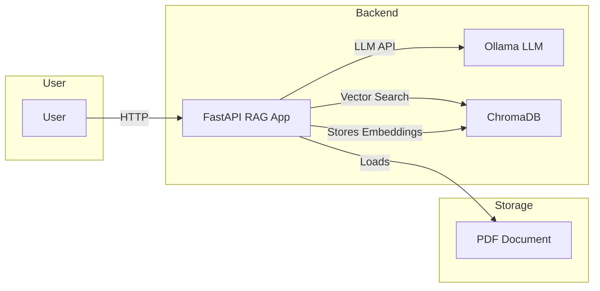
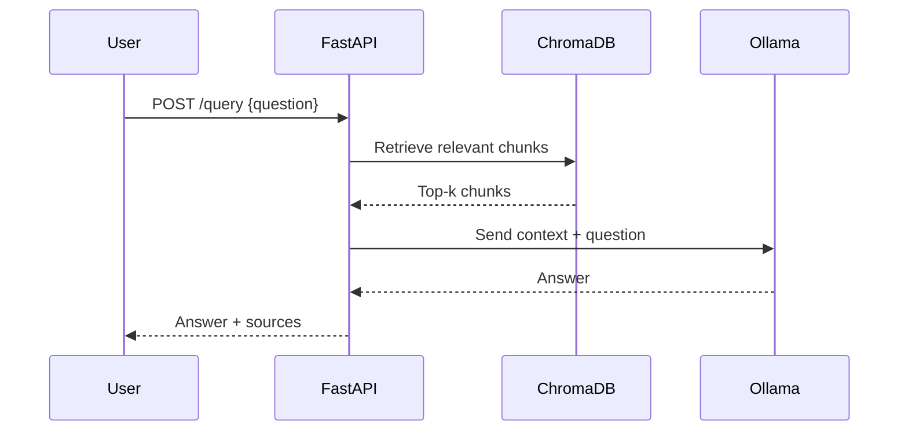

# RAG Document Q&A API

A Retrieval-Augmented Generation (RAG) system for querying legal documents using FastAPI, LangChain, Ollama, and ChromaDB. This project provides a REST API to ask questions about a PDF document, returning answers and the relevant document sources.

---

## Table of Contents
- [Overview](#overview)
- [What is RAG?](#what-is-rag)
- [Why Ollama?](#why-ollama)
- [Architecture](#architecture)
- [How it Works](#how-it-works)
- [Project Structure](#project-structure)
- [Usage](#usage)
- [API Endpoints](#api-endpoints)
- [Testing with rest-client.http](#testing-with-rest-clienthttp)
- [Diagrams](#diagrams)
- [Requirements](#requirements)
- [Deployment](#deployment)

---

## Overview
This project implements a RAG (Retrieval-Augmented Generation) pipeline to answer questions about a legal document (e.g., civil code) using a local LLM (Ollama) and a vector database (ChromaDB). The API is built with FastAPI and orchestrated with Docker Compose for easy deployment.

## What is RAG?
RAG (Retrieval-Augmented Generation) is an approach that combines information retrieval (searching for relevant documents or passages) with generative models (LLMs) to answer questions with up-to-date, contextually relevant information. Instead of relying solely on the LLM's internal knowledge, RAG retrieves relevant chunks from a document database and feeds them to the LLM for more accurate and grounded answers.

## Why Ollama?
Ollama is chosen as the LLM backend because it offers efficient, local inference of large language models (like Llama 3) **without requiring a GPU**. This makes it ideal for running on commodity hardware (e.g., laptops, servers without dedicated GPUs), providing good performance and privacy by keeping all data and computation local.

## Architecture

```mermaid
graph TD
    User[User / Client]
    subgraph API Layer
        FastAPI[FastAPI (main.py)]
    end
    subgraph RAG Pipeline
        Retriever[Retriever (ChromaDB)]
        LLM[Ollama LLM]
    end
    PDF[PDF Document]
    ChromaDB[ChromaDB Vector Store]
    Ollama[Ollama Server]

    User -- HTTP Request --> FastAPI
    FastAPI -- Query --> Retriever
    Retriever -- Embedding Search --> ChromaDB
    FastAPI -- Context + Question --> LLM
    LLM -- Answer --> FastAPI
    FastAPI -- Response --> User
    FastAPI -- Loads --> PDF
    FastAPI -- Stores Embeddings --> ChromaDB
    FastAPI -- Uses --> Ollama
    Ollama -- LLM API --> FastAPI
```

## How it Works
1. **Document Loading**: On startup, the API loads a PDF, splits it into chunks, and creates embeddings using Ollama.
2. **Vector Store**: Chunks and their embeddings are stored in ChromaDB for fast similarity search.
3. **Querying**: When a user asks a question, the API retrieves the most relevant chunks from ChromaDB.
4. **LLM Generation**: The question and retrieved context are sent to Ollama, which generates an answer.
5. **Response**: The API returns the answer and the source document chunks.

## Project Structure
- `app/main.py`: Main FastAPI app, RAG pipeline, endpoints.
- `docker-compose.yml`: Orchestrates Ollama, ChromaDB, and the API service.
- `Dockerfile`: Builds the API service container.
- `rest-client.http`: Example HTTP requests for testing the API.
- `requirements.txt`: Python dependencies.

## Usage

### 1. Build and Start Services
```bash
docker-compose up --build
```
This will start:
- Ollama (LLM server)
- ChromaDB (vector database)
- The FastAPI RAG app

### 2. Test the API
You can use the provided `rest-client.http` file (with VSCode REST Client extension or similar) or any HTTP client (curl, Postman, etc).

## API Endpoints
- `GET /` — Health check
- `POST /query` — Ask a question about the document
  - Request body: `{ "question": "Your question here" }`
  - Response: `{ "answer": "...", "source_documents": [...] }`

## Testing with rest-client.http
Example queries:

```
### Health check
GET http://localhost:8000/
Accept: application/json

### Query the document
POST http://localhost:8000/query
Content-Type: application/json
Accept: application/json

{
  "question": "In what case is the spouse's succession inadmissible?"
}
```

## Diagrams

### System Architecture


### Query Flow


## Requirements
- Docker
- Docker Compose
- (Optional) Python 3.10+ (for local development)

## Deployment
1. Place your PDF document in the `app/` directory (default: `Codigo_Civil_split.pdf`).
2. Build and run all services:
   ```bash
   docker-compose up --build
   ```
3. The API will be available at `http://localhost:8000/`.

---

## Notes
- Ollama is used for both embeddings and LLM inference, ensuring all computation is local and efficient, even on machines without a GPU.
- ChromaDB provides fast vector search for document retrieval.
- The system is modular and can be extended to use other LLMs or vector stores.
